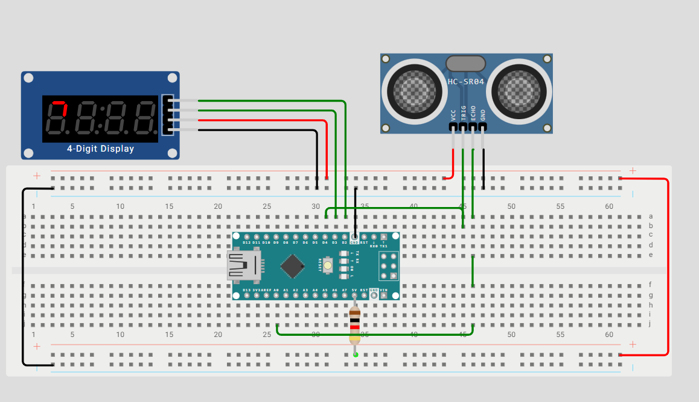

# Project Arduino - TM1637 Display 4 digits

## Description
Learn arduino: This project use to learn about the TM1637 4 Digits Display with arduino. The component list, circuit and code link below.

## Component List
```
1. Arduino Nano
2. HC-SR04 Ultrasonic Distance Sensor 4 Pin
3. TM1637 Display 4 Digits
4. Resistor
```

## Link project
```
Link Wokwi: https://wokwi.com/projects/424681243681346561
```

## Social post
- https://www.instagram.com/p/DG2_emISgnb/
  
## Simulate

